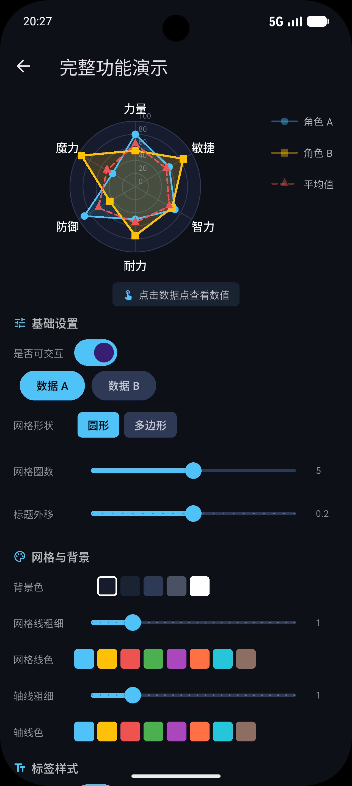
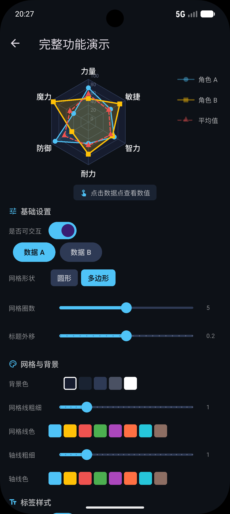
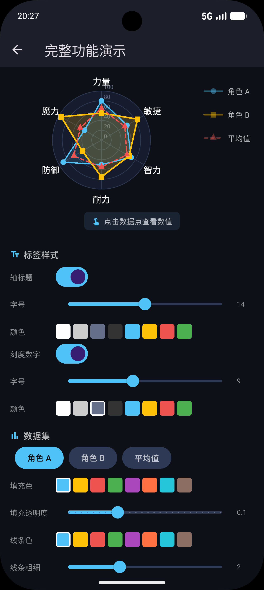
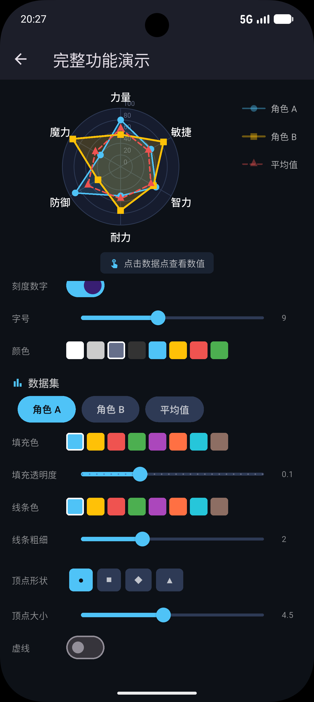
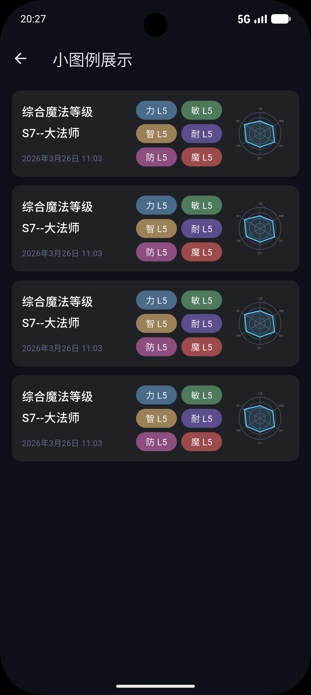

**English** | [中文](README_zh.md)

# polaris_radar

A highly customizable Flutter radar chart library with zero external dependencies.

## Features

- **Per-dataset borders** — solid or dashed (`dashArray`) per data series
- **Custom vertex markers** — `circle` / `square` / `diamond` / `triangle` / `none`
- **Grid shapes** — circular or polygon
- **Fill modes** — solid color or gradient fill per dataset
- **Touch interaction** — tap to detect vertices and edges, with highlight and tooltip
- **Legend widget** — `RadarLegendItem` matches line style and marker shape automatically
- **Dataset dimming** — `selectedDataSetIndex` highlights one series and dims others
- **Custom tick labels** — override auto-generated numeric labels
- **Implicit animations** — smooth transitions when data changes
- **Zero dependencies** — pure Flutter, no external packages required

## Getting started

Add to your `pubspec.yaml`:

```yaml
dependencies:
  polaris_radar:
    path: ../polaris_radar   # or pub.dev version once published
```

## Usage

```dart
import 'package:polaris_radar/polaris_radar.dart';

PolarisRadarChart(
  data: PolarisRadarData(
    axisLabels: ['力量', '敏捷', '智力', '耐力', '防御', '魔力'],
    maxValue: 100,
    tickCount: 5,
    gridShape: RadarGridShape.circle,
    backgroundColor: const Color(0xFF161C2E),
    gridLineStyle: const RadarLineStyle(color: Color(0xFF2E3A55), width: 1),
    axisLineStyle: const RadarLineStyle(color: Color(0xFF2E3A55), width: 1),
    tickLabelStyle: const TextStyle(color: Color(0xFF666F8A), fontSize: 9),
    axisLabelStyle: const TextStyle(color: Colors.white, fontSize: 14),
    dataSets: [
      // Solid blue line, circle markers
      PolarisDataSet(
        label: '角色 A',
        dataEntries: [80, 60, 70, 50, 90, 40],
        fillColor: Colors.blue.withValues(alpha: 0.15),
        lineStyle: RadarLineStyle(color: Colors.blue, width: 2),
        pointShape: RadarPointShape.circle,
        pointSize: 4.5,
      ),
      // Dashed red line, triangle markers
      PolarisDataSet(
        label: '平均值',
        dataEntries: [65, 55, 60, 55, 65, 50],
        fillColor: Colors.transparent,
        lineStyle: RadarLineStyle(
          color: Colors.red,
          width: 2,
          dashArray: [6, 4],   // 6px dash, 4px gap
        ),
        pointShape: RadarPointShape.triangle,
        pointSize: 4.5,
      ),
    ],
  ),
  duration: const Duration(milliseconds: 500),
)
```

### Touch interaction

```dart
PolarisRadarChart(
  data: myData,
  touchData: PolarisRadarTouchData(
    onTouch: (response) {
      if (response != null) {
        print('${response.axisLabel}: ${response.value}');
      }
    },
  ),
)
```

### Legend

```dart
RadarLegendItem(
  dataSet: myDataSet,
  lineWidth: 36,
  textStyle: const TextStyle(color: Colors.white70, fontSize: 13),
)
```

## API reference

### `PolarisRadarChart`

| Property | Type | Description |
|---|---|---|
| `data` | `PolarisRadarData` | Chart data and configuration |
| `duration` | `Duration` | Animation duration on data change (default 300ms) |
| `curve` | `Curve` | Animation curve (default `easeInOut`) |
| `touchData` | `PolarisRadarTouchData?` | Touch interaction config |
| `selectedDataSetIndex` | `int?` | Highlight one dataset, dim others |
| `interactive` | `bool` | Enable/disable touch (default `true`) |

### `PolarisRadarData`

| Property | Type | Description |
|---|---|---|
| `axisLabels` | `List<String>` | Axis titles — also determines axis count (≥ 3) |
| `dataSets` | `List<PolarisDataSet>` | One entry per data series |
| `maxValue` | `double?` | Max value; auto-detected if null |
| `minValue` | `double` | Min value (center). Default `0` |
| `tickCount` | `int` | Number of concentric rings |
| `tickLabels` | `List<String>?` | Custom tick labels; auto-generated if null |
| `gridShape` | `RadarGridShape` | `circle` or `polygon` |
| `backgroundColor` | `Color` | Fill color of the radar background |
| `gridLineStyle` | `RadarLineStyle` | Concentric grid ring style |
| `axisLineStyle` | `RadarLineStyle` | Radial axis line style |
| `tickLabelStyle` | `TextStyle?` | Tick number text style (null to hide) |
| `axisLabelStyle` | `TextStyle?` | Axis title text style (null to hide) |
| `titlePositionFactor` | `double` | Extra padding beyond radar edge (0 = tight) |

### `PolarisDataSet`

| Property | Type | Description |
|---|---|---|
| `dataEntries` | `List<double>` | Values — must match `axisLabels` length |
| `fillColor` | `Color?` | Polygon fill color (`Color?`) |
| `fillGradient` | `Gradient?` | Polygon fill gradient (overrides `fillColor`) |
| `lineStyle` | `RadarLineStyle` | Border color, width, dash pattern |
| `pointShape` | `RadarPointShape` | Marker shape at each vertex |
| `pointSize` | `double` | Marker radius in logical pixels |
| `label` | `String` | Legend label text |

### `RadarLineStyle`

| Property | Type | Description |
|---|---|---|
| `color` | `Color` | Line color (default `0xFF555555`) |
| `width` | `double` | Line width (default `1.5`) |
| `dashArray` | `List<double>?` | `null` = solid; `[6, 4]` = 6px dash + 4px gap |

### `PolarisRadarTouchData`

| Property | Type | Description |
|---|---|---|
| `onTouch` | `PolarisTouchCallback?` | Callback with `PolarisTouchResponse?` |
| `touchSpotThreshold` | `double` | Vertex hit radius in logical pixels (default 12) |
| `edgeTouchThreshold` | `double` | Edge hit distance in logical pixels (default 15) |
| `highlightColor` | `Color?` | Highlight color (defaults to line color) |
| `highlightRadiusFactor` | `double` | Highlighted vertex size multiplier (default 1.8) |
| `showTooltip` | `bool` | Show tooltip on vertex hit (default `true`) |
| `tooltipTextStyle` | `TextStyle?` | Tooltip text style |

### `RadarLegendItem`

| Property | Type | Description |
|---|---|---|
| `dataSet` | `PolarisDataSet` | The dataset to render |
| `lineWidth` | `double` | Width of the preview line (default 32) |
| `textStyle` | `TextStyle?` | Label text style |
| `spacing` | `double` | Gap between line and text (default 8) |
| `isSelected` | `bool` | Whether this item is selected |
| `onTap` | `VoidCallback?` | Tap callback |
| `selectedTextStyle` | `TextStyle?` | Text style when selected |

### Enums

```dart
enum RadarGridShape  { circle, polygon }
enum RadarPointShape { none, circle, square, diamond, triangle }
```

## Screenshots


Full demo page — 6-axis radar chart with legend and touch feedback.


            
Controls panel — scrollable parameter settings (top).    

            
Controls panel — scrollable parameter settings (middle). 

            
Controls panel — scrollable parametersettings (bottom).


Thumbnail card list — miniature radar charts.

## Demo

The `example/` directory contains a full-featured demo app with:

- **Full demo page** — 6-axis radar chart with 3 datasets, interactive control panel for all parameters
- **Thumbnail card list** — "My Reports" style cards with miniature radar charts and magic attribute tags

## License

MIT
